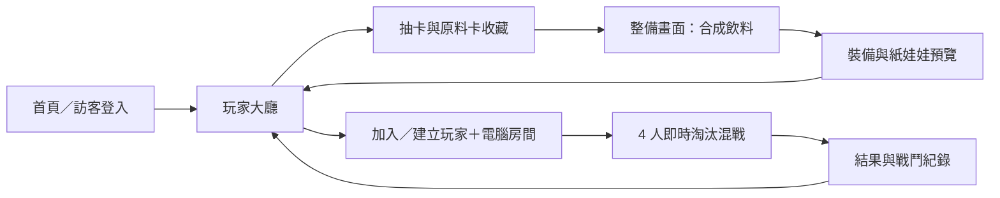

# Boba Brawl 架構草案

狀態：**待董事長確認**（2026-10-04）。本文件只定義設計方向，不代表已實作。

2026-10-05 試玩進度補充：本機原型已使用信義區 9 × 9 街區，四角出生、30 秒後縮圈。乳品已改為獨立魔法攻擊，詳見 `docs/gdd/dairy_magic_v1.md`；下文保留早期架構草案的歷史背景，正式規格仍待整併。

## 已確認的產品方向

- **取消回合制**。核心是手機橫向的即時移動、技能對戰，目標為同一房間多人連線混戰。
- 玩家在抽卡畫面永久解鎖飲料店原料卡，於獨立**整備畫面戰前合成並裝備手搖飲**；進場時人物持杯與吸管，紙娃娃外觀隨飲料變化，並以吸管發射珍珠或其他配料攻擊。
- 合成**不消耗原料卡**；一杯有兩種配料時可在戰鬥中切換彈藥。卡片稀有度與重複卡處理尚未定案。現有抽卡與合成頁面均為概念預覽。
- 首版為 **4 位角色**的即時多人房間，由真人玩家與伺服器控制的電腦玩家補滿。**最後存活者獲勝，淘汰後不重生**。沙漠、高樓大廈、海底是已提出的地圖主題；首張建議先做沙漠，後續順序待確認。

## 第一階段建議遊戲循環

`抽卡永久解鎖原料 → 查看收藏 → 整備畫面合成飲料 → 裝備飲料／預覽人物 → 加入 4 人房間（電腦補位）→ 即時移動、切換配料與吸管射擊 → 淘汰／觀戰 → 最後存活者結算 → 回到大廳`

建議第一個可玩的縱切先使用少量固定測試卡與技能，驗證「多人同房、伺服器判定命中與勝負」；20 張卡及完整合成組合在同一階段逐步補齊。**提案：**第一階段不做戰鬥中抽手牌、扇形手牌與牌組編輯；卡片先是收藏與合成原料。此項仍待董事長確認，不能視為取消所有卡牌玩法。

## 技術與責任分界（提案）

| 層 | 建議 | 責任 |
| --- | --- | --- |
| `client` | React＋TypeScript、Web/PWA | 手機橫向介面、觸控移動、技能按鈕、卡片／合成／開卡動畫、紙娃娃圖層、預測與畫面插值 |
| `server` | Node.js＋TypeScript、HTTP API＋WebSocket | 帳號與背包操作、合成與裝備驗證、房間權威狀態、移動／技能／命中／勝負裁定 |
| `shared` | 版本化資料格式與型別 | 原料卡、飲料、紙娃娃、戰鬥事件和通訊契約；不能包含只在前端驗證的規則 |
| 資料庫 | PostgreSQL | 玩家、卡片擁有量、配方、已製作飲料、裝備、對戰摘要與事件紀錄 |

React 的元件模式適合將互動畫面分開；WebSocket 提供瀏覽器與伺服器的雙向連線。版本與具體套件在實作前再鎖定。[React 官方文件](https://react.dev/learn/your-first-component)、[MDN WebSocket 文件](https://developer.mozilla.org/en-US/docs/Web/API/WebSockets_API)。

房間的即時狀態由伺服器持有。客戶端送出「移動方向／技能／切換配料指令」，不送出自行計算的座標、傷害或勝負。伺服器檢查身分、時序、速度、冷卻、資源及目標有效性後更新房間狀態，再廣播快照與事件。伺服器維護存活名單；HP 歸零即淘汰，剩一人時結算。客戶端可做流暢顯示，但以伺服器結果校正。斷線重連以房間快照恢復；持久化只記錄必要的結算與可追查事件，避免把每一影格寫進資料庫。

合成分為「預覽」與「確認製作」：預覽可由客戶端即時顯示；確認製作必須由伺服器依配方版本與玩家已解鎖原料驗證，不扣除原料卡。裝備的飲料及兩個配料槽由伺服器保存；紙娃娃只根據伺服器核准的外觀配置渲染。對戰中切換配料也由伺服器確認。

## 頁面流程

## 開發順序與驗收關卡

1. **規格確認：**玩法、合成消耗、裝備與技能對應、房間人數及勝利條件；完成資料與 API 契約。
2. **基礎資料：**訪客身分、玩家資料、原料卡收藏與測試資料，確保資料存在伺服器。
3. **戰前流程：**合成驗證、裝備飲料、紙娃娃變化；先接上目前的視覺預覽。
4. **即時戰鬥核心：**移動、至少一種技能、碰撞／命中、HP、結束條件與事件紀錄，先在受控測試環境驗證。
5. **多人房間：**多個裝置進入同房，狀態同步、斷線處理與伺服器防作弊；以至少 3 名玩家同房作為建議驗收案例。
6. **完整體驗：**首頁至戰鬥結算可走完，加入 20 張測試卡與對應合成／外觀資料；驗證 Android Chrome 與 iPhone Safari 橫向及 Safe Area。

## 待確認決策

- 裝備飲料如何影響技能、屬性與外觀？配料彈藥可切換已確認；茶底與乳品的戰鬥作用仍待企劃平衡。
- 地圖尺寸、斷線判定與縮小安全區的時序；4 人、不重生、最後存活者獲勝已確認。
- 第一階段是否保留「牌組編輯／戰鬥中使用卡牌」？本草案建議延後。
- 卡片稀有度、重複卡處理、抽卡機率與保底，依董事長指示延後決定。
